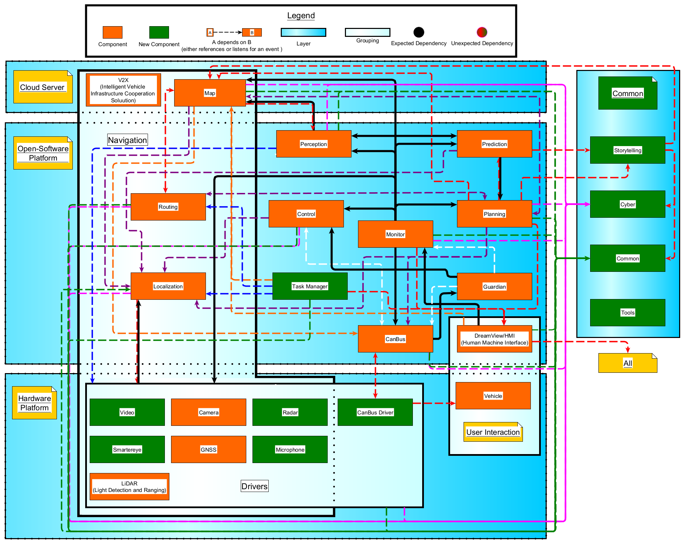

# Apollo Auto Architecture Research: Group 13

## Group Members:
- Inika Chikarmane
- Rebecca De Venezia
- Rebecca Henry
- Ensor Moriarty
- Michaelah Wales
- Hannah Weider

# Assignment 2
## Concrete Architecture
## Presentation
[Click here to view presentation.](https://www.canva.com/design/DAE4QOIsoH4/oyClYhWryUlB5Spzk695ZQ/view?utm_content=DAE4QOIsoH4&utm_campaign=designshare&utm_medium=link&utm_source=publishsharelink#2)
## Report

### <ins>ABSTRACT</ins>
### <ins>INTRODUCTION</ins>
### <ins>CONCRETE ARCHITECTURE</ins>

## <h3 align="center"> <strong> TOP-LEVEL SUBSYSTEMS </strong> </h3>
# <h4 align="center"> <em> DERIVATION PROCESS: CONCRETE ARCHITECTURE </em> </h4>
# <h5 align="center"> <strong> <em> The Mapping Process </em> </strong> </h5>
# <h5 align="center"> <strong> <em> Handling Bidirectional Dependencies </em> </strong> </h5>

# <h4 align="center"> <em> FINAL CONCRETE ARCHITECTURE </em> </h4>
# <h4 align="center"> <em> DESCRIPTION OF CONCRETE SUBSYSTEMS AND INTERACTIONS </em> </h4>
# <h4 align="center"> <em> REFLEXION ANALYSIS </em> </h4>
# <h5 align="center"> <strong> <em> Reflexion: The Common Subsystem </em> </strong> </h5>
<h5 <strong> <ins> Common <--> Cloud Server </ins> </strong></h5>
<h5 <strong> 1. Cloud Server/Navigation/map --> Common/common </strong></h5>
<h5 <strong> 2. Common/storytelling --> Cloud Server/Navigation/map </strong></h5>
<h5 <strong> <ins> Common <--> Open Software Platform </ins> </strong></h5>
<h5 <strong> 1. Open Software Platform/planning --> Common/common
</h5>
<h5 <strong> 2. Common/common --> Open Software Platform/Navigation/localization
</strong></h5>

<h5 <strong> <ins> Hardware Platform --> Common </ins> </strong></h5>
<h5 <strong> 1. Hardware Platform/Drivers/Navigation/lidar → Common/common </h5>

# <h5 align="center"> <strong> <em> Reflexion: The Cloud Server and the Open Software Platform </em> </strong> </h5>
<h5 <strong> <ins> Cloud Server <--> Open Software Platform </ins> </strong></h5> 
   
# <h5 align="center"> <strong> <em> Reflexion: Other Unexpected Dependencies with the Open Software Platform </em> </strong> </h5>

# <h5 align="center"> <strong> <em> Reflexion: Other Unexpected Dependencies with the Hardware Platform </em> </strong> </h5>

## <h3 align="center"> <strong> INNER SUBSYSTEM: LOCALIZATION </strong> </h3>
# <h4 align="center"> <em> CONCEPTUAL ARCHITECTURE </em> </h4>

# <h4 align="center"> <em> CONCRETE ARCHITECTURE </em> </h4>
# <h5 align="center"> <strong> <em> Overview </em> </strong> </h5>
# <h5 align="center"> <strong> <em> The Two Methods of Localization - The Main Components of The Subsystem </em> </strong> </h5>
# <h5 align="center"> <strong> <em> Conclusions of Concrete Subsystem and Interactions </em> </strong> </h5>

# <h4 align="center"> <em> LOCALIZATION SUBSYSTEM REFLEXION ANALYSIS </em> </h4>

## <h3 align="center"> <strong> SEQUENCE DIAGRAMS </strong> </h3>
# <h5 align="center"> <strong> <em> Overview </em> </strong> </h5>
# <h5 align="center"> <strong> <em> Use Case 1: Turning left when pedestrian runs into street to cross the road </em> </strong> </h5>
# <h5 align="center"> <strong> <em> Use Case 2: Getting a flat tire while on the road </em> </strong> </h5>

### <ins>CONCLUSION</ins>
## <h3 align="center"> <strong> SUMMARY OF FINDINGS </strong> </h3>
## <h3 align="center"> <strong> LIMITATIONS AND LESSONS LEARNED </strong> </h3>

### <ins>REFERENCES</ins>

<h5 align="center">
   <strong> Figure 1 </strong>: The mapping of source code directories to systems and subsystems in Understand.
</h5>

<h5 align="center">
   <strong> Figure 2 </strong>: The interaction between the high-level directories of the source code, highlighting the connections between subsystems not seen in our conceptual architecture.
</h5>

<h5 align="center">
   <strong> Figure 3 </strong>: The high-level architecture of Apollo Auto in Understand.
</h5>

<h5 align="center">
   <strong> Figure 4 </strong>: Dependencies in concrete architecture.
</h5>

<h5 align="center">
   <strong> Figure 5 </strong>: High-level dependencies of the conceptual and concrete architectures.
</h5>

<h5 align="center">
   <strong> Figure 6 </strong>: Conceptual Architecture of Localization Subsystem.
</h5>

<h5 align="center">
   <strong> Figure 7 </strong>: Interactions Between Components Within the Localization Subsystem.
</h5>

<h5 align="center">
   <strong> Figure 8 </strong>: Concrete Architecture Within the Localization Subsystem.
</h5>

<h5 align="center">
   <strong> Figure 9 </strong>: Sequence Diagram for Use Case 1.
</h5>

<h5 align="center">
   <strong> Figure 10 </strong>: Sequence Diagram for Use Case 2.
</h5>

# Assignment 1
## Conceptual Architecture
## Presentation
[Click here to view presentation.](https://www.canva.com/design/DAE4QOIsoH4/oyClYhWryUlB5Spzk695ZQ/view?utm_content=DAE4QOIsoH4&utm_campaign=designshare&utm_medium=link&utm_source=publishsharelink#2)
## Report
### ABSTRACT
Uncovering the conceptual architecture of a system is of interest in order to learn how
developers tackle design problems. When deconstructing an existing system, one can gain insight
into how development, data flow, testing, and reusability can maximize efficiency and minimize
“spaghetti code” that is difficult to follow. The aim is not to look at source code or
implementation details but to extract an architecture that follows best practices and suits the
domain. This report concerns itself with the conceptual architecture of Apollo Auto, a system in
continuous development created with the aim of becoming a safe platform for autonomous
driving.

We strove to answer salient questions about software design. For example, what
architecture styles best suit the overall architecture for the domain of self-driving vehicles? How
would a system for self-driving cars be designed so that it could work for most vehicles, without
redesign? What is the best way to design data flow so that the vehicle could react quickly in
emergency situations? How would an autonomous vehicle system use concurrency to maximize
resource usage? We studied available documentation on the conceptual architecture of Apollo
Auto as well as descriptions of its features along with research on the ideal architecture for
autonomous vehicles to answer these questions and more.

In short, we discovered that Apollo Auto was intelligently designed, with layers to
describe the logical division of components, hardware and software decoupled for maximum
reuse, an event-handling system for data flow, and a framework for parallel computing. The
documentation process was an excellent exercise in understanding software efficiency and
designing for a specific domain while staying true to design practices (such as minimized
cross-interactions) that benefit all systems.

### INTRODUCTION AND OVERVIEW
Apollo Auto has made incredible advancements in autonomous driving technology. So
far, the system has been applied to cars, buses, and taxis. The autonomous cars can park
themselves, reduce the time spent waiting in traffic by up to 30% by using traffic flow to
minimize the amount of red lights, share location information with other cars, use sensors of all
kinds to accurately sense its environment, and more [(“Smart Transportation Solution”)](https://apollo.auto/index.html). Apollo
Auto boasted that by the end of 2020, the software would be able to handle highways and typical
urban streets [(“Apollo's Mission”)](https://www.youtube.com/watch?v=UmKSiFujJiw).

The purpose of this report was to extract the conceptual architecture of Apollo Auto,
referring to reference architectures on autonomous driving systems and methods of extracting
architectures from documentation. The report uses an “inverted triangle” approach, beginning
with a description of the high-level architecture styles that characterize the system, then focusing
in on architecture styles that define subsystems and data flow. First, the derivation process of the
overall conceptual process is described, along with styles that were considered but ultimately
swapped out. Next, the final design for the conceptual process is detailed, along with diagrams,
descriptions of crucial components, their general interactions, and external interfaces used. What
follows is a deep dive into the evolution of the system, the data flow between parts, and how
concurrency operates within the system. Finally, the flow of usage is demonstrated with
sequence diagrams for salient use cases and the division of responsibilities among programmers.

Throughout the documentation process, we discovered that autonomous driving systems
must carefully consider both the software and hardware components in its design. Optimally, the
software and hardware components can be cleanly split into separately functioning layers.
Additionally, in order for the vehicle to stay up-to-date on traffic information and navigate its
environment safely, a Client-Server architecture style that describes a cloud that multiple
vehicles could connect to is ideal. The Publish-Subscribe style also enables the vehicles to react
to events quickly without wasting processing power, which is relevant to data flow. Finally, the
Process-Control style describes the methodology for ensuring that certain vehicle parameters
stay within a safe balance.

We also discovered that it is important to carefully consider the documentation sources
from which to extract a conceptual architecture. Even documentation from certified developers
that appears to be conceptual may be too closely coupled with concrete implementation, and may
not reflect the designer’s initial ideas. We found it useful to refer to higher-level descriptions of
the Apollo Auto system, as well as reference architecture that abstracts the most crucial parts of
the domain-specific design.

In short, we believe to have developed an accurate design that reflects the wishes of
Apollo Auto stakeholders and stays true to good practices for intelligent autonomous vehicle
systems.

### CONCEPTUAL ARCHITECTURE
<h4 align="center">
   DERIVATION AND HIGH-LEVEL OVERVIEW
</h4>
<h5 align="center">
  <em>Derivation Process</em>
</h5>
To derive the conceptual architecture, we first compiled a multitude of online resources
that described Apollo Auto’s architecture and how the system functioned. These included
conceptual documentation available from the company’s Github, reference architecture for
self-driving cars, Apollo Auto’s website, video demos, and various articles that described the
technical advancements that the company has made.

The reference architecture for autonomous vehicles by Behere and Törngren was an
excellent resource when determining the most modular way to describe an autonomous driving
architecture. When deriving our final conceptual architecture, we referred to this architecture as
it claimed to be successful for general autonomous vehicle implementations. Our goal was to
“instantiate” Behere and Törngren’s proposed structure with conceptual information available
about Apollo Auto in order to derive a conceptual architecture that was proven to be secure and
efficient to test and develop.

<h5 align="center">
  <em>Other Styles Considered</em>
</h5>

First, let us discuss styles that we considered but that were ultimately substituted for
better options. These styles include Pipe and Filter and Interpreter. First, Pipe and Filter was
considered because of how data appears to flow through the system. When examining Apollo
Auto’s documentation, it was clear that information is constantly flowing from the cloud to the
software to the hardware to the user interface and vice versa, along with calculations being done
along the way. It was initially thought that data could be traveling through pipes with incremental
filtering along the way, with the rationale that perhaps urgent data could flow to the vehicle
quicker if calculation was done incrementally, saving time in crucial emergency situations.
However, this potential advantage is overshadowed by the fact autonomous driving systems are
highly interactive and each component may need to notify another at a moment’s notice. This is
not descriptive of a Pipe and Filter style, which does not use an “event” system and whose
components are not deeply aware of what the other components do.

Next, Interpreter Style was considered, the rationale being that the language for
manipulating vehicle components might not be directly available, as commands may have to be
interpreted differently for different types of vehicles. However, a journal paper on autonomous
driving systems states: “The vehicle contains a network of electronic control units (ECUs)
controlling the basic vehicle propulsion (lateral and longitudinal acceleration, braking). The
vehicle manufacturer usually builds a ‘gateway’ that allows the experimenters to send a limited
set of commands to the ECUs in the vehicle network” [(Behere and Törngren 6)](https://doi.org/10.1016/j.infsof.2015.12.008). Thus, most
vehicle manufacturers provide functionality for developer input for direct access to vehicle
hardware, eliminating the need for the software to have a deep understanding of the
vehicle-specific implementation (more on this later).

<h5 align="center">
  <em>The Final Conceptual Architecture</em>
</h5>

<h5 align="center">
   <strong> Figure 1 </strong>: Our final conceptual architecture
</h5>

In order of decreasing abstraction, the architectural styles used for the final conceptual
architecture were Client-Server, Layered, Publish-Subscribe, and Process-Control 
(see the Data Dictionary for full definitions of these architectures). An overview
of the system’s components and their interactions will now be described, 
referencing these systems as necessary.

To begin, the Cloud Service system, which consists of components crucial to autonomous
driving technology, uses a Client-Server system to interact with the vehicle and keep it safe.
Firstly, the HD-Map uses deep learning technology to create incredibly accurate maps of the
vehicle’s surroundings that the vehicle’s software can query on the fly for navigation [(“Apollo
Open Platform”)](https://apollo.auto/developer.html). Vehicles would also use the cloud in order to interact with each other and
decrease the chance of collisions. Additionally, the V2X (Intelligent Vehicle Infrastructure
Cooperation Solution) component utilizes the cloud to retrieve local traffic data in real time
[(“V2X: Intelligent Vehicle Infrastructure Cooperation Solution”)](https://apollo.auto/v2x/index.html).

Next, Apollo Auto uses the Layered architecture style in order to sort its components into
logical tasks. This was derived by taking note that the components of an autonomous driving
system should be partitioned into a layer for cognitive driving intelligence (the logic that
determines how the car should operate) and a layer for the vehicle platform (the hardware of the
vehicle itself). Upon looking at Apollo Auto’s documentation, the system follows this rule by
partitioning the software and hardware subsystems:

<h5 align="center">
   <strong> Figure 2 </strong>: Decoupling of the cognitive driving intelligence, the vehicle 
   hardware platform, and the cloud shown in Apollo Auto’s architecture <a href="https://apollo.auto/developer.html">("Apollo Open Platform")</a>
</h5>

As briefly previously mentioned, the decoupling of the cognitive driving intelligence and
the vehicle platform is crucial to efficient development. The intelligence system does not have to
know about platform-specific details and vice versa, allowing the software to easily be deployed
to multiple vehicle types without too much re-programming. We must note, however, that such a
decoupling assumes that the vehicle hardware has “abilities for keeping the platform stable and
retaining basic self-protection measures which may include reactive control” [(Behere and Törngren 7)](https://doi.org/10.1016/j.infsof.2015.12.008). However, the majority of high-end vehicles come with these abilities built-in,
allowing for cleanly split layers in the general case. Additionally, the cloud system used by
Apollo Auto can be seen as another layer that the software interacts with.

Before we look further within, let us describe the main modules present in Apollo Auto in
order to get acquainted with the system. The Localization component makes use of the GPS,
LiDAR (Light Detection and Ranging), Camera and IMU (Inertial Measurement Unit)
components from the vehicle hardware to generate the vehicle’s exact location. The Perception
component functions as the vehicle’s “eyes,” discerning obstacles and the status of traffic lights.
Then, the Prediction component predicts the next move of each detected obstacle, and the
Planning component calculates the future trajectory of the parent vehicle. The Control
component translates the output from the Planning component into actionable commands for the
vehicle's throttle, brakes, and wheel; these are then propagated to the vehicle hardware through
the CanBus. The vehicle hardware contains the CPU, GPS, IMU, Camera, LiDAR, and multiple
Radars that collect sensor input as data to make decisions from [(“Apollo 5.5 Software Architecture”)](https://github.com/ApolloAuto/apollo/blob/master/docs/specs/Apollo_5.5_Software_Architecture.md).

Publish-Subscribe is the intuitive choice for communication between these components.
First, the system would ideally be applicable to multiple types of vehicles instead of being
designed in a vehicle-dependent fashion. Designing a system that would have to be re-designed
for each vehicle type would waste time and expenses. However, if we think of the autonomous
driving system as a vehicle with a separate “conscious” system, we can avoid the issue by
publishing events from the conscious system (i.e., planning and prediction) that the vehicle
hardware can subscribe to and respond accordingly by altering its velocity. The autonomous
driving system could be seen as a “plug-in” to the vehicle hardware, which Publish-Subscribe is
designed for.

Additionally, Publish-Subscribe is ideal for a system that is designed to react quickly to
its environment without using expensive busy-waiting that would take up processing power. The
architecture style allows components in the system to be notified of events that could happen at
any moment. For example, the Perception component could detect an unexpected swerving
vehicle, Prediction catches the event and detects their next move, Planning in turn decides the
vehicle’s trajectory, which notifies Control then the CanBus, which handles the action of
avoiding the other vehicle.

Finally, Apollo Auto uses a Process-Control architecture style as the CanBus passes data
from the vehicle hardware back to the software system [(“Apollo 5.5 Software Architecture”)](https://github.com/ApolloAuto/apollo/blob/master/docs/specs/Apollo_5.5_Software_Architecture.md).
This Process-Control subsystem is likely used to “continuously learn and adjust the model
parameters” [(Behere and Törngren 9)](https://doi.org/10.1016/j.infsof.2015.12.008). This could be used to keep parameters such as vehicle
speed and acceleration within a determined balance.

<h5 align="center">
  <em>External Interfaces</em>
</h5>

Other modules for testing and error handling purposes interact with the whole system.
Serviced by the vehicle’s Hardware Platform, the Open Vehicle Certificate Platform refers to the
interface that connects the Apollo Auto autonomous driving system with the car itself, which is
at the highest level of the system. [(“Open Vehicle Certificate Platform”)](https://apollo.auto/vehicle/certificate_en.html). The Human Machine
Interface (HMI), or DreamView, is an Open Software component that allows drivers and
developers to track and view the status of the autonomous vehicle in real time, updated by the
Monitor. The Monitor component keeps tabs on the entire system and watches for errors, alerting
the Guardian component if anything goes wrong, which would then intercede and take over
[(“Apollo 5.5 Software Architecture”)](https://github.com/ApolloAuto/apollo/blob/master/docs/specs/Apollo_5.5_Software_Architecture.md). Finally, the Cloud Service layer described above is
another example of an external interface.

<h4 align="center">
   EVOLUTION OF THE SYSTEM
</h4>

The Apollo system continuously improves its prediction models by generating semantic
maps that add data on road features to its deep learning network [(“Apollo 5.0
Technical Deep Dive”)](https://medium.com/apollo-auto/apollo-5-0-technical-deep-dive-d41ac74a23f9). These maps help improve the accuracy of models like behavior predictions, path
prediction, intersecting turning direction prediction, and more. A hierarchy of the models, ranked
by the priority of obstacles, is maintained and passed through scene analysis, intent
understanding, task prioritization and through the model scheduling framework [(“Apollo 5.0
Technical Deep Dive”)](https://medium.com/apollo-auto/apollo-5-0-technical-deep-dive-d41ac74a23f9). The system then automatically selects a model that will result in the best
prediction currently possible. This process allows the system’s models to evolve so prediction
results can continuously improve.

As new road conditions and driving use cases are introduced to the system, the planning
component evolves to become more modular and scenario specific. This means that each driving
use case can be addressed individually so that scenario-specific issues can be reported and
resolved independently from other scenarios [(“Apollo 5.5 Software Architecture”)](https://github.com/ApolloAuto/apollo/blob/master/docs/specs/Apollo_5.5_Software_Architecture.md). The planner
also uses optimization algorithms to improve the distribution of speed and acceleration over
time, and the Open Space Planner uses a model-based optimization scheme that represents
obstacle shapes and road boundaries to utilize the vehicle dynamics model more efficiently
[(“Apollo Open Platform”)](https://apollo.auto/developer.html). Similarly, AI techniques and ‘data-driven solutions’ allow the
perception component to improve its detection and recognition capabilities over time [(“Apollo Open Platform”)](https://apollo.auto/developer.html). Overall, by continuously optimizing and updating its components, the system
is able to evolve by improving its prediction models, perception, planning, and overall
performance over time.

<h4 align="center">
   CONTROL AND DATA FLOW AMONG PARTS
</h4>
<h5 align="center">
  <em>Implicit Invocation and Process-Control Architecture for Data Flow</em>
</h5>

By comparing high-level summaries of the Apollo architecture to the reference
architecture for autonomous driving by Sagar Behere and Martin Törngren, we can derive a
possible conceptualization of the data flow throughout the software that is based on how Apollo
appears to employ generalized components of autonomous driving software. The data flow
among parts can be described primarily using Implicit Invocation and Process-Control
architectural styles (see the Data Dictionary for full definitions of these architectures).

<h5 align="center">
   <strong> Figure 3 </strong>: Functional Architectural View (FAV) of an autonomous driving system,
   from the reference architecture paper
</h5>

The reference FAV is split into three categories: Perception (interpreting the data gathered
using sensors), Decision and Control (controlling the vehicle with respect to the vehicle’s
environment) and Vehicle Performance Manipulation (sensing the control of the vehicle in order
to achieve the desired motion).

In the functional reference architecture for autonomous driving by Sagar Behere and
Martin Törngren, the “decision and control” category refers to the functional components
involving the vehicle’s behavior and characteristics in the context of its external environment.
The relationship between the components in these categories can be managed using
Process-Control architecture. Data is provided by the elements of the “perception” category, and
the elements of the “decision and control” can utilize this input to form reference values which
will be maintained through the manipulation of variables in components of the “decision and
control” and “vehicle platform manipulation” categories to control the vehicle.

By examining high level descriptions of Apollo’s open software platform on the software
overview page [("Apollo Open Platform")](https://apollo.auto/developer.html), we can determine which of these modules
belong to the three categories of the reference architecture and create a conceptual view of how
information will flow between them.

<h5 align="center">
   <strong> Figure 4 </strong>: Apollo Modules in the Open Software Platform
</h5>

Apollo’s Perception module maps to the Perception category of the reference
architecture. “The perception module identifies the world surrounding the autonomous vehicle.”
[(“Apollo 5.5 Software Architecture”)](https://github.com/ApolloAuto/apollo/blob/master/docs/specs/Apollo_5.5_Software_Architecture.md)

The Prediction and Planning modules in Apollo deal with the ref. component of
Trajectory generation. The trajectory generation component involves the generation of
obstacle-free trajectories through the vehicle’s environment (in the world coordinate system)
[(Behere and Törngren 5)](https://doi.org/10.1016/j.infsof.2015.12.008). The Apollo Prediction module anticipates the motion of obstacles, the
Routing module tells the vehicle how to reach its destination, and the Planning module plans the
vehicle’s spatio-temporal trajectory. Each of these three components receive data from the HD
Map (a module in the cloud service platform level of Apollo’s system), and the Localization
Modules. “The localization module leverages various information sources such as GPS, LiDAR
and IMU to estimate where the autonomous vehicle is located.” [(“Apollo 5.5 Software Architecture”)](https://github.com/ApolloAuto/apollo/blob/master/docs/specs/Apollo_5.5_Software_Architecture.md) The HD map
provides structured information regarding roads.

There are several Apollo modules that provide data to the “control” components. The
control components rely on data flow from modules such as the HD Map. Components that
require information on roads should employ the Implicit Invocation (Publish-Subscribe)
architectural style to subscribe to events broadcast by the HD map module to receive information
about the environment of the vehicle. This will serve as input for components in the “control”
and “manipulation” categories when calculating reference values to maintain during
Process-Control processes.

Apollo’s control module subscribes to information broadcast by the trajectory generation
components: “The control module executes the planned spatio-temporal trajectory by generating
control commands such as throttle, brake, and steering.” [(“Apollo 5.5 Software Architecture”)](https://github.com/ApolloAuto/apollo/blob/master/docs/specs/Apollo_5.5_Software_Architecture.md). This maps to the
Trajectory Execution component described in the reference architecture (the component which
actually executes the trajectory generated by Decision and Control).

The control module publishes control information that the Guardian and CanBus modules
use. The guardian is a safety module that intervenes in the event that the Monitor module detects
a failure. The monitor Module surveils all the modules in the vehicle including hardware, and
provides this data to the Guardian and Human-Machine Interface modules.

The CanBus module “is the interface that passes control commands to the vehicle
hardware. It also passes chassis information to the software system” [(“Apollo 5.5 Software Architecture”)](https://github.com/ApolloAuto/apollo/blob/master/docs/specs/Apollo_5.5_Software_Architecture.md).

Finally, the result of this control information is sent to the Human-Machine Interface
module. “Human Machine Interface or DreamView in Apollo is a module for viewing the status
of the vehicle, testing other modules and controlling the functioning of the vehicle in real-time.”

In this mapping of a high level Apollo system modules to the reference architecture components
we can trace the flow of data between related components, and see where control modules
receive their inputs, and where the control instructions will be passed between modules.

<h4 align="center">
   CONCURRENCY
</h4>

Concurrency is an incredibly important feature of countless systems, and the Apollo self
driving system is no exception. When implemented well, tasks communicate, execute, and
collaborate efficiently and effectively. Apollo uses it for large scale tasks like controlling speed
and direction, or gathering, processing, and using data about the road ahead, or even performing
all those tasks simultaneously. It also facilitates smaller scale tasks like adjusting the volume of
the entertainment system, or changing the A.C. according to the user’s settings. In the very few
reported cases where concurrency has been buggy in the Apollo system, it was found to have
detrimental effects on the speed control [(Garcia, et al. 7)](https://doi.org/10.1145/3377811.3380397).

Concurrency is dependent on the operating system, or in this case the operating platform.
Apollo uses a centralized and parallel computing model. Apollo’s operating platform has a central component, the Apollo Cyber RT framework, that collects information from the other components and directs them. It deals with each task it’s faced with through the use of a DAG
(directed acyclic graph) dependency graph. A DAG graph uses an algorithm that takes into
account the “priority, running time, and resource usage” [(“Introduction to Baidu Apollo Cyber
RT, Basic Concepts and Comparison with ROS”)](https://www.codetd.com/en/article/12255887) of each task to determine how to direct each
task. Then, a task is placed on a queue. Which queue and where is determined by a scheduler that
takes into account resources, time, and urgency. When it is ready to execute, a task is “executed
as an optimized thread” [(“Apollo Cyber RT Framework”)](https://apollo.auto/cyber.html) - threads being a very lightweight, and
computationally efficient process. At runtime, when the fused sensors start collecting data and
incorporating user-tasks, all components work together with the Apollo Cyber RT Framework to
manage and execute tasks in parallel, led by the fused sensor input [(“Apollo Cyber RT
Framework”)](https://www.codetd.com/en/article/12255887).

Ultimately, Apollo’s conceptual architecture with regards to concurrency is grounded in
their centralized and parallel computing model and strongly relies on the Apollo Cyber RT
framework. It consists of multiple components, all linked together by a central component which
uses a DAG graph to manage their tasks. Efficiency and parallelism is achieved through the use
of the scheduler, lightweight threads, and resource management. This is depicted in figure X
[(“Apollo Cyber RT Framework”)](https://apollo.auto/cyber.html).

<h5 align="center">
   <strong> Figure 5 </strong>: Centralized and Parallel computing model using Cyber RT Framework [(“Apollo Cyber RT Framework”)](https://apollo.auto/cyber.html).
</h5>

<h4 align="center">
   FLOW OF USAGE
</h4>
<h5 align="center">
  <em>Overview</em>
</h5>

To demonstrate our conceptual architecture we made sequence diagrams depicting two
use cases. The sequence diagrams were made using the components from our conceptual
architecture and serve to show how they interact in real settings. We tried to pick non-trivial
use-cases which demonstrate how the architecture can handle tough situations.

<h5 align="center">
  <em>Use Case 1: Turning left when pedestrian runs into street to cross the           road</em>
</h5>

<h5 align="center">
   <strong> Figure 6 </strong>: Sequence Diagram for Use Case 1
</h5>

For the first use case, the scenario begins with the vehicle stopped at a red light.
Throughout the execution of the sequence CanBus is continuously being updated with the state
of the hardware, and the Monitor is subsequently being updated with the status of all components
of the system. As well, Perception is being updated by the Navigation component and the
prediction of the world around it is continually being updated through data shared between
Perception and Prediction. These continuous processes are made clear at the top of the sequence
diagram.

Once the Perception component sees that the light has turned green, the Prediction
component is alerted. After the Prediction component predicts that the way is clear, the Planning
component is alerted and the Control component is called to generate commands for the vehicle.
The commands are passed through Guardian, and CanBus relays the commands over to the
hardware to initiate the left turn through the intersection. While the vehicle is performing the
turn, during one of the updates to the Monitor, Prediction alerts the Monitor that a pedestrian is
likely going to enter the road in front of them soon, based on current trajectories. (Learned
through the constant updates to predictions of the world.) Once Monitor is alerted of this
suspected collision, Monitor relays the information to Guardian and the HMI component, which in turn displays the concern to the driver.

Once the driver is alerted, either the driver will take over and bring the vehicle to a stop,
or the guardian prevents further commands from going through, allowing the car to slow down,
until 10 seconds have passed without the driver intervening. If 10 seconds have passed, Guardian
will then alert the CanBus to perform an emergency stop, which will cause the vehicle to brake
hard and come to a stop.

<h5 align="center">
  <em>Use Case 2: Getting a flat tire while on the road</em>
</h5>

<h5 align="center">
   <strong> Figure 7 </strong>: Sequence Diagram for Use Case 2
</h5>

For the second use case, the scenario begins with the vehicle in motion. Again throughout
the execution of the sequence components are continually being updated as before. The top of
the sequence diagram shows the computations continually being performed, with new commands
constantly being generated and passed to the Guardian component for approval.

Suddenly one of the tires pops and CanBus is alerted through one of its constant
hardware updates. The CanBus relays a message to the monitor informing it of the hardware
error, and the monitor subsequently alerts both the Guardian and the HMI which in turn alerts the
driver. From this point either the driver will respond and bring the vehicle to a safe stop, or the
Guardian will take over. If the driver fails to respond, the Guardian will attempt to bring the car
to a safe stop. The Guardian requests information from the Monitor to learn about its
surroundings and if the sensors are functioning and there are no obstacles, it alerts the CanBus to
bring the vehicle to a slow stop. Otherwise if it can’t confirm that a slow stop is possible, it will
alert the CanBus to perform an emergency stop.

<h4 align="center">
   DIVISION OF RESPONSIBILITIES
</h4>

The layered architecture style used acknowledges that the system’s technical
implementation is broadly separated on the basis of the cognitive driving functions and the
vehicle platform functions [(Behere and Törngren 7)](https://doi.org/10.1016/j.infsof.2015.12.008). Within this however, the layered style
allows for each of the layers to be implemented by a different team, and gives them the freedom
of allowing them to make their own decisions regarding specifics like programming style,
technology stacks and tools used.

Control engineers interestingly are allowed to have less coding-focused roles and more
algorithmic focused concerns. They use tools that enable them to execute models without having
to consider the minutiae like memory allocation. This allows them to test and verify their
algorithms.

Embedded systems programmers would be employed in order to handle concerns related
to program efficiency, and keeping it conservative and real-time. They are also concerned with
the scheduling of tasks, interrupt handlers, input and output, etc.
The control engineers and embedded systems programmers together usually implement
the different components in the vehicle. Simultaneously, the cognitive driving intelligence related
components would be implemented by computer scientists.

A major benefit of the architectural styles employed is that the different components
(HMI, Hardware, Monitor, Navigation, Perception, Prediction, Planning, Control, Guardian, and
CanBus) are enabled to be developed and appropriately tested independently. This strongly
supports the notion of this being an open-source project, as otherwise, this can be harder to
implement because of the independence and sheer number of developers that often have
restricted communication with one another. The figure below outlines the broad setup that would
be employable, and highlights the benefits in the developmental process of using the
Publish-Subscribe style in such a context.

<h5 align="center">
   <strong> Figure 8 </strong>: Set up for division of responsibilities in the development and testing process, from the
reference architecture paper
</h5>

### CONCLUSION
<h4 align="center">
   SUMMARY OF FINDINGS
</h4>
In summary, our Apollo Auto architecture uses Client-Server, Layered,
Publish-Subscribe, and Process-Control styles. This allows the system to maintain the vehicle’s
safety, divide its components into logical tasks that are independent of one another, react quickly
to the environment, and continuously evolve by learning and improving models. We also found
that the Apollo system uses a centralized and parallel computing model to maintain concurrency
which facilitates large and small scale tasks such as speed and volume control, respectively. By
developing two use cases we were able to successfully demonstrate how our derived conceptual
architecture would perform in real settings. Moving forwards, we will use our understanding of
the conceptual architecture of Apollo to construct its concrete architecture.

<h4 align="center">
   LESSONS LEARNED
</h4>
One of the biggest things we learned was coming to an understanding of what is
conceptual versus concrete architecture. We realized that when we had begun our project, we had
focused more on details relevant to the concrete architecture. We later had to revisit our initial
ideas and change information in our report, referring more to other high-level documents and
reference architecture. This understanding, however, will be helpful in the next assignment when
we expand the conceptual architecture to derive the concrete details of the systems.

### DATA DICTIONARY
<h4 align="center">
   ARCHITECTURE STYLES
</h4>

##### *Client-Server Architecture*

A Client-Server architecture style is used when an application requires “distributed data
and processing across a range of components” [(Adams)](https://onq.queensu.ca/d2l/le/content/642417/viewContent/3751085/View) The style partitions components
into servers and clients. Servers remotely provide a service such as making a connection
or making changes to a database to clients that require that service. Clients connect to
servers through networks.

##### *Layered Architecture*

A Layered architecture style is used when the services of the system can be divided into
hierarchies that mimic Client-Server style, as each layer of the hierarchy acts as the
server to the layer above. Layered style is exceptional at highlighting the interaction
between parts that carry out different tasks and operate within distinct subsystems.
Similarly, layers can be partitioned into tiers that describe the physical divide between the
parts of the system [(Adams)](https://onq.queensu.ca/d2l/le/content/642417/viewContent/3751085/View).

##### *Implicit Invocation (Publish-Subscribe) Architecture*

An Implicit Invocation architecture style is useful when components need to be notified
of certain changes instantaneously, without “busy-waiting” (constantly polling) for those
changes to happen. Instead, components would “subscribe” to events that other
components choose to broadcast and would be notified when the event takes place.
Subscribed and published events serve as input and output data to other components,
respectively [(Adams)](https://onq.queensu.ca/d2l/le/content/642417/viewContent/3751085/View).

##### *Process-Control Architecture*

In elements of the system that involve maintaining reference values by the manipulation
of variables, the Process-Control style will be used. The two main components of this
style are the Process and the Controller. The Controller is given a controlled variable with
a target that we want it to reach. All input variables are given to the Process, which
manipulates the variables and feeds them back into the Controller (creating a “loop”).
The Controller will then manipulate the variables appropriately in order to converge the
target variable [(Adams)](https://onq.queensu.ca/d2l/le/content/642417/viewContent/3751085/View).

### REFERENCES
Adams, Bram. Architecture Styles. Jan 2022,
https://onq.queensu.ca/d2l/le/content/642417/viewContent/3751085/View. PowerPoint
Presentation.  

“Apollo Cyber RT Framework.” Apollo, Baidu, 2020, https://apollo.auto/cyber.html.  

“Apollo Cyber Security.” Apollo, Baidu, 2020, https://apollo.auto/platform/security.html.  

“Apollo Open Platform.” Apollo, Baidu, 2020, https://apollo.auto/developer.html.  

“Apollo's Mission.” Youtube, Baidu, 6 Nov. 2017,
https://www.youtube.com/watch?v=UmKSiFujJiw.  

“Apollo 5.0 Technical Deep Dive.” Medium, Apollo Auto, 3 July 2019,
https://medium.com/apollo-auto/apollo-5-0-technical-deep-dive-d41ac74a23f9.  

“Apollo 5.5 Software Architecture.” GitHub, ApolloAuto, 3 Jan. 2020,
https://github.com/ApolloAuto/apollo/blob/master/docs/specs/Apollo_5.5_Software_Architecture.md.  

Behere, Sagar, and Martin Törngren. “A Functional Reference Architecture for Autonomous
Driving.” Information and Software Technology, vol. 73, 2016, pp. 136–150.,
https://doi.org/10.1016/j.infsof.2015.12.008.  

Garcia, Joshua, et al. “A Comprehensive Study of Autonomous Vehicle Bugs.” Proceedings of
the ACM/IEEE 42nd International Conference on Software Engineering, 2020,
https://doi.org/10.1145/3377811.3380397.  

“Introduction to Baidu Apollo Cyber RT, Basic Concepts and Comparison with ROS.” Code
World, 24 Jan. 2021, https://www.codetd.com/en/article/12255887.  

“Open Vehicle Certificate Platform.” Apollo, Baidu, 2020,
https://apollo.auto/vehicle/certificate_en.html.  

“Smart Transportation Solution.” Apollo, Baidu, 2020, https://apollo.auto/index.html.  

“V2X: Intelligent Vehicle Infrastructure Cooperation Solution.” Apollo, Baidu, 2020,
https://apollo.auto/v2x/index.html.  

# Assignment 0
## Related Links:

### Overview:
[Apollo Github Repository](https://github.com/ApolloAuto/apollo)  
[Apollo Release Notes](https://github.com/ApolloAuto/apollo/releases)

### Mission Statement:
[Apollo's Mission](https://www.youtube.com/watch?v=UmKSiFujJiw)

### Demos:
[Complete Urban Journey in a Baidu Apollo Autonomous Vehicle](https://www.youtube.com/watch?v=EY3yVgLecf0)  
[Testing Apollo Auto - DreamView Demo](https://www.youtube.com/watch?v=JWoNMFsPRH8)

### Group Policies:
[Apollo Manifesto (Data Sharing Policies)](https://apollo.auto/docs/promise.html)  
[Apollo Governance Policies](https://apollo.auto/docs/manifesto.html)

### Software Architecture:
[Software Specifications Github Directory](https://github.com/ApolloAuto/apollo/tree/master/docs/specs)  
[Overview of software components](https://apollo.auto/developer.html)  
[Apollo's Cyber Security](https://apollo.auto/platform/security.html)  
[Apollo's Compatibility](https://apollo.auto/vehicle/certificate_en.html)  
[Inside Apollo 6.0: A Road Towards Fully Driverless Technology (Report on Company Architecture)](https://medium.com/apollo-auto/inside-apollo-6-0-a-road-towards-fully-driverless-technology-522b2b4295cc)  
[RTI brings communications software to Baidu Apollo autonomous driving ecosystem (Information Sharing)](https://www.therobotreport.com/rti-communications-software-joins-baidu-apollo-self-driving/)

### Articles and News:
[Concordia researchers dig deep into the software powering self-driving cars](https://www.concordia.ca/news/stories/2020/11/03/concordia-researchers-dig-deep-into-the-software-powering-self-driving-cars.html)  
[Building a self-driving car that people can trust](https://www.technologyreview.com/2020/12/16/1014672/building-a-self-driving-car-that-people-can-trust/)  
[Apollo from a hardware perspective](https://www.neousys-tech.com/en/discover/fanless-in-vehicle-pc/baidu-apollo-open-source-autonomous-driving-platform)  
[Baidu May Reach Fully Autonomous Driving Faster than Tesla](https://www.youtube.com/watch?v=Zcw70M51FbM)  
[Initiating the war on car information security, Baidu Apollo builds the highest level of security protection shield](https://inf.news/en/auto/0fd3a2aac718d068c3fe570e54829ebc.html)

### Tutorials:
[Official development/engineering tutorial](https://apollo.auto/devcenter/devcenter.html)  
[Self-Driving Car Fundamentals Introductory Video](https://www.youtube.com/watch?v=Tsr2iSA8TgA)  
[Self-Driving Car Fundamentals Course](https://www.udacity.com/course/self-driving-car-fundamentals-featuring-apollo--ud0419?utm_source=youtube&utm_medium=social&utm_campaign=apollo)  
[How To Build A Self Driving Car (Miniature)](https://www.youtube.com/watch?v=cB_ez2MNHMo)

### Simulations:
[SVL Simulator by LG](https://www.youtube.com/watch?v=Ucr0aM334_k&feature=youtu.be)  
[Apollo Game Engine Based Simulator](https://apollo.auto/gamesim.html)

### Textbooks:
[Performance, Security, and Safety Requirements Testing for Smart Systems Through Systematic Software Analysis](https://deepblue.lib.umich.edu/bitstream/handle/2027.42/151693/kehong_1.pdf?sequence=1)

## Assignments:

- [x] &nbsp; A0: Create a group of 6 (on OnQ) and group website 
- [x] &nbsp; A1: Document the conceptual architechture
- [ ] &nbsp; A2: Recover the concrete architechture and compare to the conceptual
- [ ] &nbsp; A3: Propose an enhancement, then propose and compare 2 designs / implementation plans

## Project Mark Breakdown:
1. Submit group of 6 on onQ (otherwise random)                           
> 21 Jan 
3. Create & share group website (+ group name)                  
> 4%  31 Jan 
5. Conceptual Arch. Report [15p.] & Pres. [10'] (A1)         
> 14+8%  18 Feb 
7. Concrete Arch. Report [15p.] & Pres. [10'] (A2)           
> 14+8%  18 Mar 
9. Arch. Enhancement (A3) - talk with your TA                    
> week of 21 Mar 
11. Arch. Enhancement Report [15p.] & Pres. [10'] (A3)         
> 14+8%  8 Apr

Source: Week 1 Lecture Slides and Syllabus, page 30 and 37
